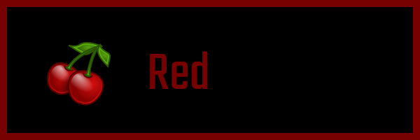
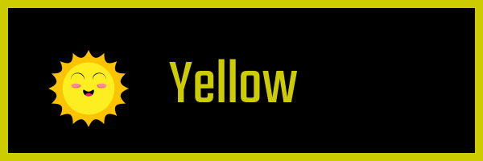

# HTML Image Generator

The HTML Image Generator allows you to generate multiple images, with a common layout, using an HTML file as the template.

Potential uses include:
* Generating social media preview images for a series of blog posts.
* Creating images with a common background and varying text.
* Anything where you want to have multiple similar images.

## Mail Merge for Images

Using the image generator is as easy as creating address labels.

These images:

   

are all generated from the same basic HTML markup:

```html
<body>
	<div class="container">
		
		<p class="name">{{name}}</p>
	</div>
</body>
```

And it's as simple as:

1. Create a template for your images using HTML.
2. Prepare the data source
3. Run the generator.

## Quick Start

A sample template is included in [`template/sample.htm`](template/sample.htm) and sample data files in [the `data` directory](data).

1. Install [NodeJS](https://nodejs.org/)
2. [Download the application](https://github.com/thatblairguy/html-image-generator/archive/main.zip)
3. Run `npm install` from the application's root directory.
4. From the application's root directory, run
```bash
node index.js
```


## Installation

_Prerequisite_ The HTML Image Generator requires that you install [NodeJS](https://nodejs.org/)

1. [Download the application](https://github.com/thatblairguy/html-image-generator/archive/main.zip)
2. In the application's root directory, run
```bash
npm install	
```

## Create a Template

The HTML image generator transforms HTML files into an images. The HTML file is created to look like the final version of the image, and then the portions that will vary between versions of the image are replaced with placeholder values.

```html
<body>
	<div class="container">
		
		<p class="name">Green</p>
	</div>
</body>
```
(see [layout.htm](template/layout.htm) for the full file)

External resources (images, stylesheets, etc.) may be loaded from either subdirectory paths relative to the HTML file, or from any accessible web site.

_**TIP:** Place a `<div>` element (e.g. the "container" div in this exmple) around the entire markup and style it with a fixed height and width equal to the desired image size; next, add a solid, 1 pixel, visible border. This will allow you to preview the image and compare how it aligns to the planned edges. Once the layout is complete, change the border to match the background._

Once the layout has been created, locate the elements which will vary between images, and replace them with placeholder values surrounded by double curly-braces (`{{` and `}}`). In this example, the text `image/frog.png` and `Green` will be replaced by other images and color names, leading to this template file:

```html
<body>
	<div class="container">
		
		<p class="name">{{name}}</p>
	</div>
</body>
```

The [layout.htm](template/layout.htm) file also contains some CSS for the `container` div:

```css
.container {
	height: 200px;
	width: 600px; 
	border: #0f0 10px solid;
}
```

The border color changes too, so the `#0f0` color code is also replaced with a placeholder, becoming:
```css
.container {
	width: 580px;
	height: 180px;
	border: {{colorCode}} 10px solid;
}
```

_**TIP:** Technically, the template file is a [Handlebars template](https://handlebarsjs.com/), and may be as complex or simple as desired._

### Configure the template

In the `config` sub-directory, create a new file named `local.json`. This is where you override the settings to control the image file size and the template name. (Don't edit the defaults file!)

The `local.json` should look something like this:
```json
{
    "templates": [
        {
            "template":"template/sample.htm",
            "width": 600,
            "height": 200
        }
    ]
}
```

Change the `width` and `height` values to the desired image size and change the `template` value to your actual template.

(_**NOTE:** although `templates` is an array, support for multiple templates is planned for a future version. For now, only the first set of values is used._)

## Create the data source

In the `data` subdiretory, create a separate `.json` file for each image you would like to create.  Each file must contain the name and replacement values for each of the placholders in the template.  The [formal specification for JSON files is online](https://www.json.org/), but a quick summary is that the file is a collection of name/value pairs. Each name appears in quotation marks (That's "double quotes" **NOT** the so-called 'single quotes'), is followed by a colon, and then the value. String values must also appear in quotation marks, numbers may appear without. Each name/value pair is separated from the next by a comma, and the entire thing is surrounded by curly braces (`{` and `}`).

Continuing with the above example, `red.json` would be
```json
{
    "name": "Red",
    "image": "image/cherries.png",
    "colorCode": "#770000"
}
```
`green.json` would be
```json
{
    "name": "Green",
    "image": "image/frog.png",
    "colorCode": "#007700"
}
```
and so on.

The generated files will use the same name as the JSON file (e.g. `red.json` will contain values for creating `red.png`, `yellow.json` will create `yellow.png` and so on).

## Running the Image Generator

Congratulations if you've made it this far! The steps you should have completed by now are:

1. Install [NodeJS](https://nodejs.org/)
2. [Download the application](https://github.com/thatblairguy/html-image-generator/archive/main.zip)
3. Run `npm install` from the application's root directory.
4. [Create a template](#create-a-template)
5. [Configure the template](#configure-the-template)
6. [Create the data source](#create-the-data-source)

To generate the images, from the application's root directory, run the command
```bash
node index.js
```

(There are no command-line parameters.)

If all goes well, the generated images should appear in the `output` directory.
